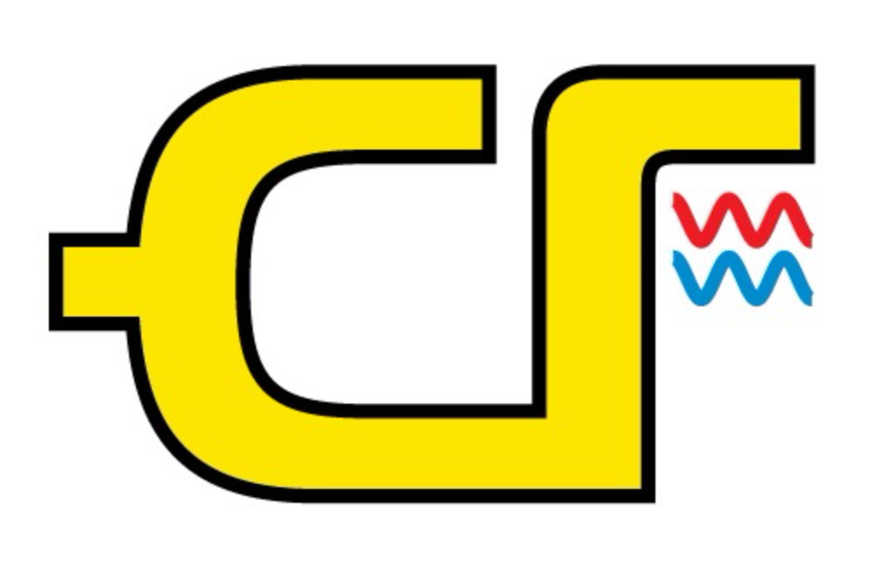

# CyborgFlow

CyborgFlow provides an out-of-the-box (OOTB) solution to perform load test on your online system, powered by Apache APISIX, Apache SkyWalking and Apache ShardingSphere.

## Quick Start

### Download release package

Please download the package from the [release page](https://github.com/SphereEx/CyborgFlow/releases):

### Setup Cyborg Database Shadow

1. Unpack the **cyborg-database-shadow.tar.gz**.
2. Follow [document](cyborg-database-shadow/README.md#quick-start) to quick start the server.

### Setup Cyborg Dashboard

1. Unpack the **cyborg-dashboard.tar.gz**.
2. Follow [Backend Document](https://skywalking.apache.org/docs/main/latest/en/setup/backend/backend-setup/) to start the dashboard backend.
3. Follow [UI Document](https://skywalking.apache.org/docs/main/latest/en/setup/backend/ui-setup/) to start the dashboard UI, then you could access via `http://localhost:8080`, but not exists any data for now, because the application not setup yet.

### Setup Cyborg Agent

1. Unpack the **cyborg-agent.tar.gz**.
2. Follow [setup document](https://skywalking.apache.org/docs/skywalking-java/latest/en/setup/service-agent/java-agent/readme/) config the agent to your application and make the agent link to the Cyborg Dashboard backend.
3. Change the address of the linked database in your application to the Cyborg database shadow server address.
4. Start your application.

### Setup Cyborg Flow Gateway

1. Please follow [quick start document](cyborg-flow-gateway/README.md) to install `APISIX` and link to the Cyborg Dashboard backend and your application.
2. Trigger request to access your application via `APISIX`.

### View the Dashboard

1. Access the Cyborg Dashboard UI.
2. Click the `Cyborg Flow` tab to switch the dashboard. Then you could get the traffic information.

# License
Apache 2.0
